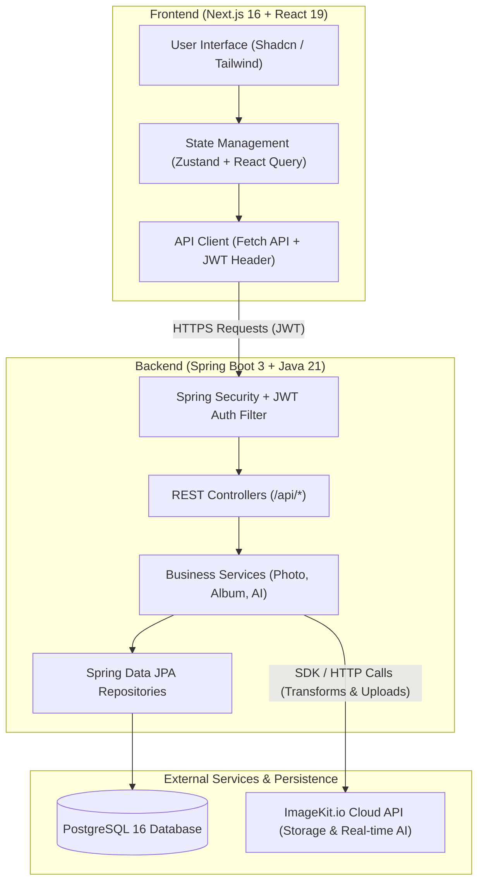

# Google Photos Clone 📸✨

A full-stack, enterprise-grade **Google Photos Clone** built with **Spring Boot 3 / Java 21** on the backend and **Next.js 16 (React 19) / TypeScript** on the frontend. The application delivers cloud media storage, intelligent photo management, dynamic albums, trash/archive workflows, storage analytics, and powerful **AI-powered image transformations** powered by **ImageKit API**.

---

## 📋 Table of Contents

- [Overview](#overview)
- [Key Features](#key-features)
- [System Architecture & Data Flow](#system-architecture--data-flow)
- [Tech Stack](#tech-stack)
- [Deep-Dive: How The Project Works](#deep-dive-how-the-project-works)
  - [1. Authentication & Security](#1-authentication--security)
  - [2. Media Storage & ImageKit Integration](#2-media-storage--imagekit-integration)
  - [3. AI Transformation Pipeline](#3-ai-transformation-pipeline)
  - [4. Photo Lifecycle & State Management](#4-photo-lifecycle--state-management)
- [Project Structure](#project-structure)
- [Prerequisites & System Requirements](#prerequisites--system-requirements)
- [Environment Configuration](#environment-configuration)
  - [Backend Configuration (`.env`)](#backend-configuration-env)
  - [Frontend Configuration (`.env.local`)](#frontend-configuration-envlocal)
- [Getting Started & Local Setup](#getting-started--local-setup)
  - [Step 1: Start PostgreSQL Database](#step-1-start-postgresql-database)
  - [Step 2: Run the Spring Boot Backend](#step-2-run-the-spring-boot-backend)
  - [Step 3: Run the Next.js Frontend](#step-3-run-the-next-js-frontend)
- [API Reference Endpoints](#api-reference-endpoints)
- [License & Acknowledgments](#license--acknowledgments)

---

## 🌟 Overview

The **Google Photos Clone** offers a seamless, cloud-native experience for managing personal media collections. Designed to replicate core features of Google Photos while extending them with generative AI capabilities, this project supports real-time multi-file upload, background removal, object-aware cropping, generative fill, AI retouching, custom prompts, smart album grouping, and trash management.

---

## 🚀 Key Features

### 🔐 Authentication & Session Management
- **User Registration & Login**: BCrypt password hashing (strength 12) with JWT authentication.
- **Stateless Tokens**: Short-lived Access Tokens paired with Refresh Tokens for seamless session renewal.
- **Protected Routes**: Middleware guard on Next.js frontend and Spring Security filters on the backend.

### 🖼️ Photo & Media Management
- **Direct & Multipart Uploads**: Upload JPEG, PNG, WebP, GIF, HEIC images directly to user-isolated Cloud Storage.
- **Grid Library View**: Dynamic responsive grid displaying high-res thumbnails with date-based sorting.
- **Status Workflows**: Move photos between **ACTIVE**, **ARCHIVE**, and **TRASH** states.
- **Bulk Operations**: Perform multi-photo archive, move to trash, restore, or permanent deletion.
- **Storage Analytics**: Track overall storage consumption, photo counts, and cloud bandwidth.

### 🤖 AI Image Studio (ImageKit AI Integration)
- **Background Removal (`REMOVE_BACKGROUND`)**: Automatically isolate subjects and eliminate backgrounds.
- **Background & Drop Shadow (`BACKGROUND_AND_SHADOW`)**: Remove background while adding a natural drop shadow.
- **Prompt-Based Background Change (`CHANGE_BACKGROUND`)**: Replace backgrounds using text prompts.
- **Generative Fill (`GENERATIVE_FILL`)**: Expand image canvas and generate seamless fills based on dimensions and prompts.
- **Smart & Object Crop (`SMART_CROP` / `OBJECT_CROP`)**: Auto-focus on primary subjects or specific target objects (e.g., face, dog, car).
- **AI Upscaling & Retouch (`UPSCALE` / `RETOUCH`)**: Enhance resolution and touch up image details automatically.
- **AI Prompt Edit (`AI_EDIT`)**: Modify image elements dynamically using natural language prompts.
- **Live Preview & Non-Destructive Saving**: Preview transformations instantly before saving them as new derived photos.

### 📁 Custom Albums & Collections
- **Album Management**: Create, update title, list, and delete custom albums.
- **Cover Photo Resolution**: Dynamic assignment of album cover thumbnails.
- **Photo Association**: Add/remove multiple photos to/from albums with auto-computed item counts.

### ☁️ Cloud Library Import
- **Asset Synchronization**: Discover and import existing assets directly from configured ImageKit folders into user libraries without re-uploading.

---

## 🏗️ System Architecture & Data Flow



---

## 🛠️ Tech Stack

### Backend Technologies
| Layer | Technology |
|---|---|
| **Language & Runtime** | Java 21 |
| **Framework** | Spring Boot 3.4+ / Spring MVC |
| **Security** | Spring Security 6, JJWT 0.12.6, BCrypt |
| **Data Access** | Spring Data JPA, Hibernate |
| **Database** | PostgreSQL 16 (via Docker) |
| **Cloud Storage & AI** | ImageKit Java SDK (v3.4.0) |
| **Utilities** | Lombok, Dotenv-Java, Jakarta Validation |
| **Build Tool** | Apache Maven |

### Frontend Technologies
| Layer | Technology |
|---|---|
| **Framework** | Next.js 16 (App Router), React 19 |
| **Language** | TypeScript 5 |
| **Styling** | Tailwind CSS v4, Lucide Icons, Remixicon |
| **UI Components** | Shadcn UI, Base UI, Sonner Toasts |
| **State & Data Fetching** | Zustand, TanStack React Query v5 |
| **Forms & Validation** | React Hook Form, Zod |

---

## 💡 Deep-Dive: How The Project Works

### 1. Authentication & Security
1. When a user registers or logs in (`/api/auth/register`, `/api/auth/login`), the backend validates credentials and issues a **JWT Access Token** (short TTL) along with a **Refresh Token** stored in PostgreSQL.
2. The frontend stores tokens in client memory via `Zustand`.
3. Every outgoing API call attaches `Authorization: Bearer <token>`.
4. Spring Security's `JwtAuthenticationFilter` intercepts requests, validates the signature, extracts the user details, and sets the Security Context.

### 2. Media Storage & ImageKit Integration
1. Files uploaded through the UI are posted to `/api/photos/upload`.
2. The `PhotoService` validates allowed MIME types (`JPEG`, `PNG`, `WebP`, `GIF`, `HEIC`).
3. `ImageKitService` streams the bytes to ImageKit Cloud under a user-isolated folder path (`/users/{userId}/`).
4. ImageKit returns a `fileId`, original `url`, and generated thumbnail `url`.
5. The backend stores metadata (dimensions, file size, MIME type, user reference, status) in the PostgreSQL `photos` table.

### 3. AI Transformation Pipeline
1. When editing a photo in the AI Studio, the frontend sends transformation parameters (e.g., type, prompt, width/height, object focus).
2. `AiTransformService` maps request parameters to ImageKit URL transformation parameters (e.g., `e-bgremove`, `bg-genfill-prompt-...`, `fo-auto`).
3. **Preview Mode**: Returns a transformation URL for immediate visual confirmation in the UI.
4. **Apply Mode**:
   - The backend requests the transformed image from ImageKit.
   - If ImageKit is asynchronously processing the AI edit, `ImageKitService` intelligently polls with backoff until processing finishes.
   - The resulting image bytes are uploaded back to ImageKit as a new asset.
   - A derived `Photo` record is saved in the database referencing its parent photo (`parentPhotoId`) and transformation type (`aiTransformType`).

### 4. Photo Lifecycle & State Management
- **ACTIVE**: Visible in main photo feed and library.
- **ARCHIVE**: Hidden from main stream, accessible under Archive tab.
- **TRASH**: Soft-deleted photos stamped with `deletedAt`.
- **Permanent Delete**: Deletes the physical file from ImageKit cloud via API call and removes the metadata row from PostgreSQL.

---

## 📂 Project Structure

```
google-photos-springboot-clone/
├── docker-compose.yml          # Docker composition for PostgreSQL container
├── README.md                   # Complete project documentation
├── backend/                    # Spring Boot REST API
│   ├── .env.example            # Environment variables template for backend
│   ├── pom.xml                 # Maven dependencies configuration
│   └── src/main/java/project/backend/
│       ├── config/             # Security, CORS, ImageKit, JWT properties
│       ├── controllers/        # Auth, Photo, PhotoAi, Album, Library APIs
│       ├── domain/             # JPA Entities (User, Photo, Album, RefreshToken)
│       ├── dto/                # Data Transfer Objects (Requests/Responses)
│       ├── exception/          # Global Exception Handler & Custom Errors
│       ├── repository/         # Spring Data JPA Repositories
│       ├── security/           # JWT Filter & UserDetails implementation
│       └── services/           # Business logic (Photo, AI, ImageKit, Album, Auth)
└── client/                     # Next.js 16 Frontend App Router
    ├── package.json            # Node.js dependencies & scripts
    ├── app/                    # Next.js pages & layout routes
    │   ├── (app)/              # Authenticated layout (Photos, Albums, Archive, Trash)
    │   └── (auth)/             # Login & Registration pages
    ├── components/             # UI components (Photo grid, AI editor, Albums)
    ├── hooks/                  # Custom React hooks
    ├── lib/                    # API fetcher, type definitions, helper utilities
    └── stores/                 # Zustand state stores (auth-store)
```

---

## ⚙️ Environment Configuration

### Backend Configuration (`backend/.env`)

Copy `backend/.env.example` to `backend/.env` and update the values:

```ini
# Database Connection (Default PostgreSQL docker port: 5434)
DB_URL=jdbc:postgresql://localhost:5434/google_photos
DB_USERNAME=postgres
DB_PASSWORD=postgres

# Security & CORS
CORS_ORIGIN=http://localhost:3000
JWT_SECRET=your_super_secret_jwt_key_at_least_32_bytes_long_here!
ACCESS_TOKEN_EXPIRATION=86400000
REFRESH_TOKEN_EXPIRATION=604800000

# File Upload Limits
MAX_FILE_SIZE=25MB
MAX_REQUEST_SIZE=30MB

# ImageKit Configuration (Get credentials from https://imagekit.io)
IMAGEKIT_PUBLIC_KEY=public_your_key_here
IMAGEKIT_PRIVATE_KEY=private_your_key_here
IMAGEKIT_URL_ENDPOINT=https://ik.imagekit.io/your_imagekit_id
```

### Frontend Configuration (`client/.env.local`)

Create `.env.local` inside the `client/` directory:

```ini
NEXT_PUBLIC_API_URL=http://localhost:8080/api
```

---

## ⚡ Getting Started & Local Setup

Follow these steps to set up and run the application locally.

### Step 1: Start PostgreSQL Database
Run the pre-configured PostgreSQL container via Docker Compose:

```bash
docker-compose up -d
```
> Database runs on port `5434`, default database `google_photos`, user `postgres`, password `postgres`.

### Step 2: Run the Spring Boot Backend

Navigate to the backend folder, ensure `.env` file exists, and start the Spring Boot application using Maven wrapper:

```bash
cd backend

# On Windows PowerShell / Command Prompt:
.\mvnw.cmd spring-boot:run

# On Linux / macOS:
./mvnw spring-boot:run
```
> Backend runs at `http://localhost:8080`. Database tables will auto-generate on initial run.

### Step 3: Run the Next.js Frontend

Navigate to the client directory, install npm packages, and start the development server:

```bash
cd client

# Install dependencies
npm install

# Start development server
npm run dev
```
> Frontend will be available at `http://localhost:3000`.

---

## 📑 API Reference Endpoints

### 🔑 Authentication (`/api/auth`)
| Method | Endpoint | Description | Auth Required |
|---|---|---|---|
| `POST` | `/api/auth/register` | Register new user account | ❌ No |
| `POST` | `/api/auth/login` | Authenticate user & get JWT tokens | ❌ No |
| `POST` | `/api/auth/refresh` | Refresh expired access token | ❌ No |
| `POST` | `/api/auth/logout` | Revoke refresh token | ❌ No |
| `GET` | `/api/auth/me` | Fetch authenticated user profile | ✅ Yes |

### 📸 Photos (`/api/photos`)
| Method | Endpoint | Description | Auth Required |
|---|---|---|---|
| `GET` | `/api/photos` | List user photos (supports status `ACTIVE`, `ARCHIVE`, `TRASH`) | ✅ Yes |
| `GET` | `/api/photos/{id}` | Get photo details by ID | ✅ Yes |
| `POST` | `/api/photos/upload` | Upload multipart image file to ImageKit | ✅ Yes |
| `POST` | `/api/photos/archive` | Move batch of photos to archive | ✅ Yes |
| `POST` | `/api/photos/trash` | Move batch of photos to trash | ✅ Yes |
| `POST` | `/api/photos/restore` | Restore batch of photos from archive/trash | ✅ Yes |
| `POST` | `/api/photos/delete-permanent` | Permanently delete photos from trash & cloud storage | ✅ Yes |
| `DELETE` | `/api/photos/{id}` | Permanently delete single photo | ✅ Yes |

### 🤖 AI Transformations (`/api/photos/{photoId}/ai`)
| Method | Endpoint | Description | Auth Required |
|---|---|---|---|
| `POST` | `/api/photos/{photoId}/ai/preview` | Generate live preview URL for AI edit | ✅ Yes |
| `POST` | `/api/photos/{photoId}/ai/apply` | Apply AI edit, upload & save as new derived photo | ✅ Yes |

### 📁 Albums (`/api/albums`)
| Method | Endpoint | Description | Auth Required |
|---|---|---|---|
| `GET` | `/api/albums` | List all user albums | ✅ Yes |
| `POST` | `/api/albums` | Create a new album | ✅ Yes |
| `GET` | `/api/albums/{id}` | Get album by ID | ✅ Yes |
| `GET` | `/api/albums/{id}/photos` | Paginated photos inside album | ✅ Yes |
| `PATCH` | `/api/albums/{id}` | Update album details | ✅ Yes |
| `DELETE` | `/api/albums/{id}` | Delete album | ✅ Yes |
| `POST` | `/api/albums/{id}/photos` | Add photos to album | ✅ Yes |
| `DELETE` | `/api/albums/{id}/photos/{photoId}` | Remove photo from album | ✅ Yes |

### 📊 Library & Storage (`/api/library`)
| Method | Endpoint | Description | Auth Required |
|---|---|---|---|
| `GET` | `/api/library/storage` | Get storage analytics and item metrics | ✅ Yes |
| `GET` | `/api/library/imagekit-assets` | List unimported assets in ImageKit folder | ✅ Yes |
| `POST` | `/api/library/import` | Batch import ImageKit assets into user library | ✅ Yes |

---

## 🤝 License & Acknowledgments

- Built with ❤️ using [Spring Boot](https://spring.io/projects/spring-boot) and [Next.js](https://nextjs.org).
- Image cloud storage & Generative AI transformations powered by [ImageKit.io](https://imagekit.io).
